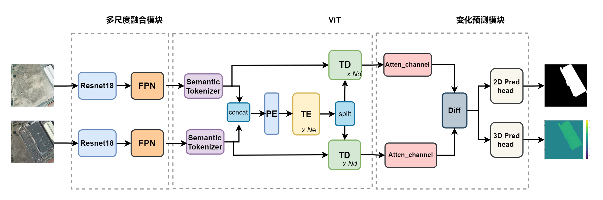

"# MSFT_3DCD"

# Change Detection for Remote Sensing Image

This work is based on MSFT, which is in

and activate 3D change detection ,which is based on 3DCD in https://github.com/VMarsocci/3DCD.git.



## Installation

Clone this repo:

```shell
git clone https://github.com/Jasmine-wrl/MSFT_3DCD.git
```

* Download [Python 3](https://www.python.org/)
* Install the packages:

```shell
pip install -r requirements.txt
```

## Train

To train the model, prepare a *.yaml* file and put in the `config` directory (where you can find an example) and then run the following command:

```shell
python train2.py --config="your_config_file"
```

## Test

To test your model, follow the same steps for training and then run the following command:

```shell
python test2.py --config="your_config_file"
```

## Dataset Preparation

### Data structure

```
"""
3DCD dataset
├─train
   ├─t1
   ├─t2
   ├─2dcd
   └─3dcd
├─val
   ├─t1
   ├─t2
   ├─2dcd
   └─3dcd
└─test
   ├─t1
   ├─t2
   ├─2dcd
   └─3dcd
"""
```

### Data Download

The original 3DCD dataset  are as follows:

https://drive.google.com/drive/folders/1XRmUeIevRfZT982verCI4kq_8CRR4ueq?usp=sharing

In this work,I cropped the original images into 200*200 and splited the train/val/test into 1600:164:120. The  cropped dataset(200 *200) are as follows:

3DCDMY_200: https://pan.baidu.com/s/1ACvG8CL5x91pHdlQjcZETA (code：ns62)

## License

Code is released for non-commercial and research purposes **only**. For commercial purposes, please contact the authors.
